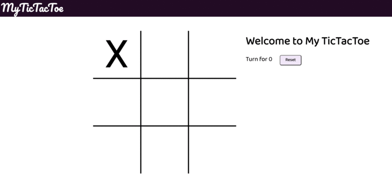

# Tic Tac Toe 

### Details
<ul>
<li>A tic tac toe game created using Vanilla Javascript</li>
<li>User can play this game in different screen device[Responsive!]</li>
<li>Play this game enjoying music for different features.</li>
</ul>

# About game

2 player X & O, by default, when any square is clicked X is marked and then player O and so on. This is human vs human, which can be played by 2 person or single person. For every turn a massage is displayed along with music. The result is displaying after if the match draw and if the match won by any of the player, the winner is displayed and a gameover music is there.

# Game Board

